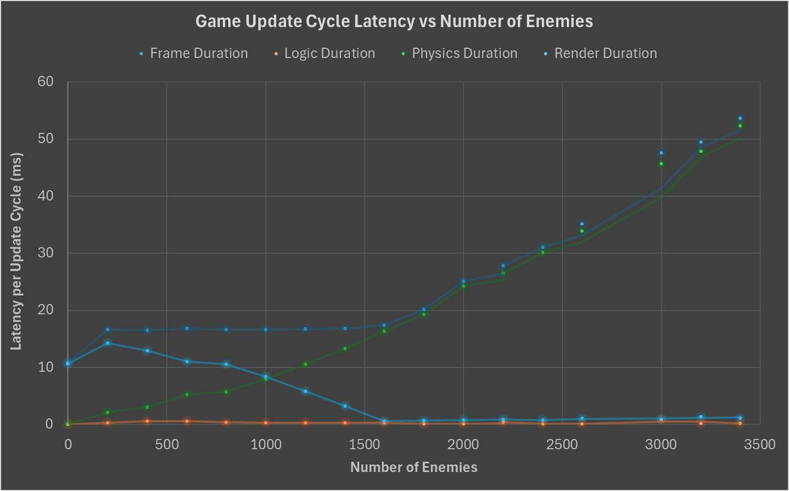
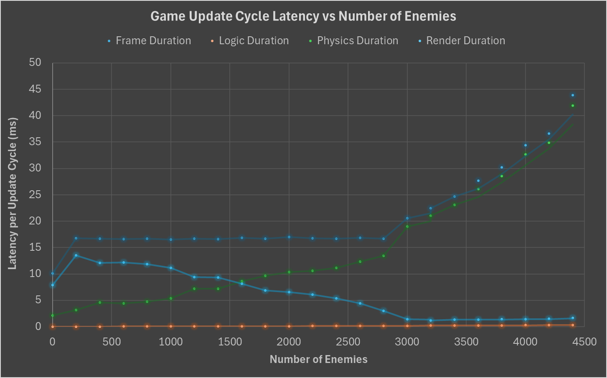

# Multithread Performance Analysis

## How Box2D Multithreading Reduces Physics Latency
1. When game loop reaches ``b2World_Step(worldId, deltaTime, 4);``, it chunks the enemies to figure out which bodies are near each other, then does the math (i.e. collision solving, velocity updates, position updates) and breaks it down into smaller independent tasks
2. For each task generated in (1), Box2D calls EnqueueTask()
3. EnqueueTask() uses std::async to spin up a background thread (or use available one from OS) to execute the Box2D chunk
4. Box2D looks at FinishTask() and gets blocked unless future is valid
5. Once all tasks are completed, future is valid and thus all threads can continue and control is handed back to the main game loop to move to the Render phase

## Performance on Single Thread

## Performance on Multiple Threads

## Discussion
The multithreading implementation was a success.

### Reduction in Peak Latency
With a single thread, at 3,400 enemies, the physics step alone took over 50ms to process, dragging the total frame duration right along with it. 
With multithreading, at that exact same enemy count, the physics duration dropped to roughly 23ms—a greater than 50% reduction in pure physics latency.

### Pushing the 60 FPS Ceiling 
To maintain a smooth 60 FPS, total frame duration must stay under 16.6ms.
Before, our single-threaded setup broke the 16.6ms barrier at roughly 1,700 enemies.
After, with multithreading, our engine comfortably maintained 60 FPS all the way up to 2,800 - 2,900 enemies before the physics calculations began bottlenecking the main thread again.

### Higher Maximum Capacity
The performance gains allowed us to extend your testing scale. 
Our single-threaded test peaked and struggled at 3,500 enemies. 
Our new multi-threaded architecture successfully pushed to 4,400 enemies while still maintaining a lower overall frame latency (~44ms) than the single-threaded version did at its much lower 3,500 cap.
